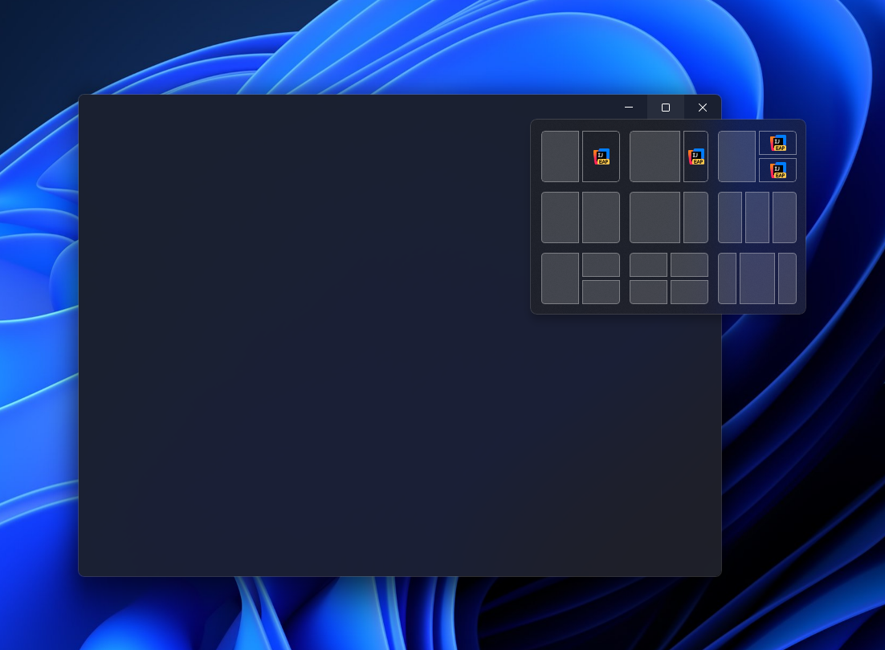

# Tauri Plugin Window Controls



Native Windows 11 caption controls (minimize / maximize / close) for Tauri windows, with snap-layout support.

The plugin removes the system frame (keeping the drop shadow) and injects a framework-agnostic runtime that draws
pixel-perfect caption buttons. Maximize hover shows the Windows 11 snap-layout flyout via a native hit-test overlay. The
glyphs are rendered from the system caption font through DirectWrite, so they match the OS exactly.

**Windows-only by design.** On every other target the extension-trait methods are no-ops and `init()` registers an empty
plugin — nothing from this crate ends up in non-Windows builds.

## Install

```toml
# Cargo.toml
[dependencies]
tauri-plugin-window-controls = "0.1"
```

Depend on it unconditionally — no `[target.'cfg(windows)'.dependencies]` and no
`#[cfg(windows)]` around `init()` are needed. On non-Windows targets the crate compiles to an empty plugin: the native
code, caption commands, and injected JS runtime are all gated out, so nothing Windows-specific is bundled.

Register the plugin at `lib.rs`:

```rust
#[cfg_attr(mobile, tauri::mobile_entry_point)]
pub fn run() {
    tauri::Builder::default()
        // ...
        .plugin(tauri_plujgin_window_controls::init())
        .setup(setup)
        .build(tauri::generate_context!())
        .expect("error while running tauri application")
        .run(on_run_event);
}
```

Add the default permission to your capability file (e.g. `capabilities/default.json`):

```json
{
  "permissions": [
    "window-controls:default"
  ]
}
```

## Usage

Configure the overlay while building a window with `WindowControlsBuilderExt`:

```rust
use tauri::WebviewWindowBuilder;

#[cfg(windows)]
use tauri_plugin_window_controls::WindowControlsBuilderExt;

pub fn create_main_window() {
    let builder = WebviewWindowBuilder::new();

    // ...

    #[cfg(target_os = "macos")]
    let win_builder = win_builder.traffic_light_position(LogicalPosition::new(15.0, 22.0));

    #[cfg(target_os = "windows")]
    let win_builder = win_builder.title_bar_overlay(true).title_bar_height(46);

    // ...

    win_builder.build()?;
}
```

Or configure an already-created window (e.g. one declared in `tauri.conf.json`)
with `WindowControlsExt`:

```rust
use tauri_plugin_window_controls::WindowControlsExt;
use tauri::{WebviewWindow, command};

#[command]
pub fn set_title_bar_overlay(window: WebviewWindow) {
    window.set_title_bar_height(40)?;
    window.set_title_bar_overlay(true)?;
}
```

The setters are order-independent — the injected runtime reads the configured height and colors when the DOM is ready.

### Custom colors

Override the caption colors per theme. Any omitted token falls back to the plugin's built-in Windows-native default.

```rust
use tauri_plugin_window_controls::{TitleBarColors, WindowControlsBuilderExt};
use tauri::{WebviewWindow, command};

#[command]
fn set_title_bar_colors(window: WebviewWindow) {
    let light = TitleBarColors {
        symbol: Some("#1a1a1a".into()),
        hover: Some("#0000000f".into()),
        ..Default::default()
    };

    let dark = TitleBarColors {
        symbol: Some("#ffffff".into()),
        ..Default::default()
    };

    window.set_title_bar_colors(light, dark)?;
}
```

## License

[MIT](./LICENSE)
